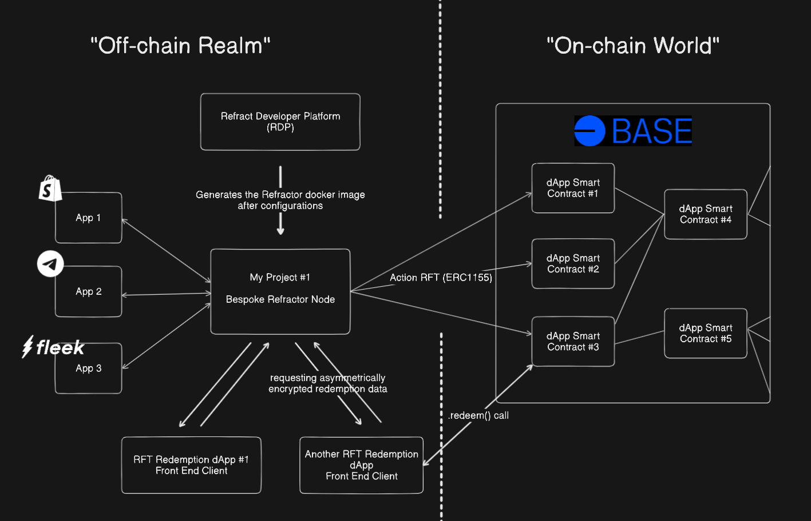

# Refract Developer Platform Documentation
### _Base On-chain Summer Buildathon, Discovery Track_

**To see how you can use RDP to integrate Shopify products with your dApps within mere minutes, check out our demo video [here!](youtu.be/g_A6Cgj88iA) (https://youtu.be/g_A6Cgj88iA)**
## Overview
The Refract Developer Platform (RDP) is an all-in-one oracle SDK toolkit made for developers to scalably and cheaply integrate their on-chain dApps with web2 app services (i.e. Shopify), empowering dApp projects to bring more real-world consumer utilities and value onto the blockchain.

RDP achieves so by providing developers the start-to-finish toolkit needed for building and deploying bespoke service oracles using a no-code interface. RDP eradicates the need for dApp projects to engineer their own data connectors to popular web2 app services by providing these battle-tested data connectors out of the box. Developers simply have to cherry pick from the wide collections of web2 app endpoints that RDP supports and configure the parameters associated with these web2 app services (i.e., which Shopify products to tokenize as ERC1155 tokens)

We decided to devote our time into building RDP for the Base On-chain Summer Buildaton's Discovery Track because we are excited about Base's ambition for driving consumer crypto adoption. We believe that with RDP's unparalleled DevX, we are fostering the growth of a new wave of consumer dApps within the base ecosystem. We would love to continue to work with Base to bring RDP to the next level and to help Base achieve its vision of a consumer-friendly blockchain ecosystem.



## Current Support
The RDP currently supports tokenization for the following services:
1. Shopify Products
2. Tremendous Gift Cards
3. Fleek Functions
4. Zapier Zaps
   These integrations allow developers to create unique, tokenized representations of Web2 assets and actions, which can then be utilized in Web3 environments.
## Fleek Integration: Expanding Web3 Utility
Our integration with Fleek is particularly exciting, as it significantly expands the utility of dApps and the broader Web3 ecosystem. Fleek’s serverless functions allow developers to:
1. Create powerful, customizable off-chain actions that can be tokenized
2. Enhance dApp functionality with complex computations and integrations
3. Bridge the gap between decentralized applications and traditional web services
   By incorporating Fleek into our platform, we’re enabling developers to build more versatile and feature-rich Web3 applications that can interact seamlessly with Web2 services.
## Future Plans
We are committed to expanding our platform’s capabilities and integrations. Our roadmap includes:
1. Square integration for broader e-commerce support
2. Social media platform integrations (Telegram, Discord)
3. Enhanced on-chain ownership mechanisms
4. Improved interoperability between Web2 and Web3 services
   Our goal is to create a comprehensive ecosystem that enables developers to build innovative applications that leverage the best of both Web2 and Web3 technologies.
## Setup Procedure
To run RDP, please follow the steps below:
1. Setup the production server environment. Rename the .env.example files (in both backend/ and frontend/) to .env and fill in the required fields as described.
2. Start the backend server by running the following commands:
   ```bash
   cd backend
   npm install
   node main.js
   ```
3. Launch the frontend application by running the following commands:
   ```bash
    cd frontend
    npm install
    npm start
   ```